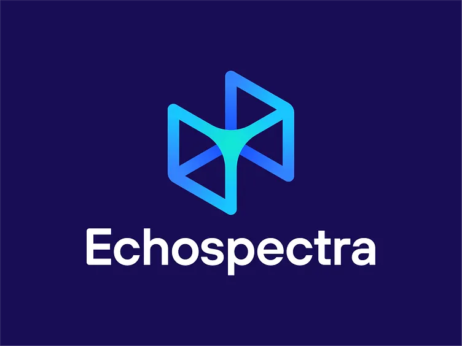
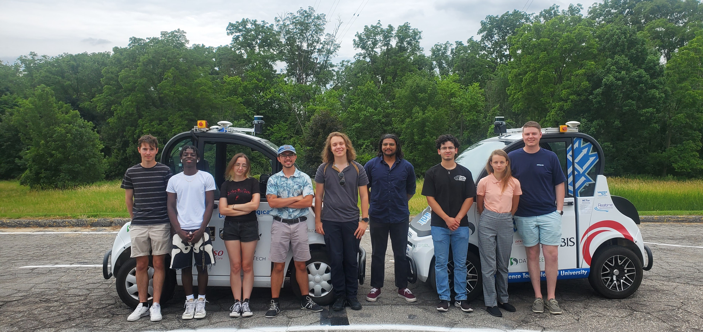

  

  <a href="#education">Education</a> ·
  <a href="#professional-experience">Professional Experience</a> ·
  <a href="#projects">Projects</a> ·
  <a href="#skills">Skills</a> ·
  <a href="#contact">Contact</a>

# Beñat Froemming-Aldanondo

I'm a data and software engineer who aims to make a positive impact. I graduated with a Bachelor's in Data Science and Master's in Computer Science from the University of Minnesota - Twin Cities (May 2026). I'm currently starting a new role as a Geospatial Data Analyst II at Echospectra. I'm passionate about maps, geospatial data, and new technologies.

## Education

### **Master of Science in Computer Science**  
**University of Minnesota – Twin Cities**  
*September 2025 – May 2026*  
**GPA:** 4.0 / 4.0  

### **Bachelor of Science in Data Science**  
**University of Minnesota – Twin Cities**  
*September 2021 – May 2025*  
**GPA:** 3.75 / 4.0  

**Relevant Coursework:** Software Engineering, Data Structures & Algorithms, Computer Systems & Databases, Project Management, Machine Learning, Robotics, Artificial Intelligence, Computer Vision, Natural Language Processing, Recommender Systems, Deep Learning, Data Analytics, Geocomputing

**Research:** Undergraduate Research Assistant through UROP on intelligent transportation. Presented my work at the AAAI 2025 conference.

**Activities:** Social Coding, Running Club, IM Soccer

 

 

## Professional Experience

### **Geospatial Data Analyst II**  
**Echospectra**  
Remote, USA  
*September 2026 – Present*  

Diagnosing and preventing wildfires through data.

 

 

### **Software Engineer**  
**The Toro Company**  
Bloomington, MN  
*September 2025 – August 2026 · 1 yr*  

- Built and deployed a full-stack web dashboard used by engineers to analyze and visualize telematics data from 30,000+ connected machines on an interactive map.
- Reduced telematics device setup time across manufacturing workflows by developing API-driven provisioning tools.

**Technologies:** React, Python, Flask, SQL, Snowflake, Azure DevOps, SQLite, MapLibre

### **Engineering Data Analytics Intern**    
**The Toro Company**    
Bloomington, MN  
*May 2025 – August 2025 · 4 mos*  

- Improved telematics data accuracy by developing automated Python tests and visualizations to validate machine-to-cloud data pipelines before integration into customer-facing applications.

**Technologies:** Python, SQL, Snowflake, CAN, Excel

 

 

### **Research Experiences for Undergraduates (REU)**    
**National Science Foundation (NSF)**  
Detroit, MI  
*May 2024 – August 2024 · 4 mos*  

- Reduced vehicle idling time at intersections by 75% compared to human drivers by developing adaptive speed-control algorithms and a low-cost roadside unit for real-time vehicle-to-infrastructure traffic signal communication.
- Developed vision-based systems for safer lane following in electric vehicles, validated through on-vehicle and closed-course testing.

**Technologies:** Python, ROS, C++, OpenCV, Scikit-learn, GitHu

 

 

### **Other Employment** 

- Student Assistant at the UMN Electrical and Computer Engineering Department · 5 yr
- Undergraduate Research Assistant (UROP)
- Lifeguard at the Hutchinson Aquatic Center
- Landscaper at the Crow River Golf Course

## Projects

I've worked on many projects through coursework, research, and personal exploration. Here's a selection of my favorites:

- **[Explicode](https://github.com/benatfroemming/explicode)** — An open-source tool that turns scripts into readable docs by supporting Markdown in comments.
- **[ChatOSM](https://github.com/benatfroemming/ChatOSM)** — A chatbot built on an open-weight model that turns natural language prompts into map visualizations by querying OpenStreetMap data.
- **[Metro Transit Visualizer](https://benatfroemming.github.io/metrotransit/)** — A web app that visualizes live Twin Cities transit data using the NexTrip API.

## Skills

- **Programming:** Python, Java, C/C++, JavaScript/TypeScript, SQL, R
- **Web & Software:** React, HTML, CSS, Flask, FastAPI, Git, GitHub, Azure DevOps, VS Code
- **Data & ML:** Pandas, NumPy, Matplotlib, scikit-learn, PyTorch, OpenCV, Hugging Face, LangChain, Gradio
- **Databases & Cloud:** PostgreSQL, SQLite, Supabase, Snowflake, AWS, Vercel, Cloudflare
- **Geospatial:** MapLibre, Leaflet, Mapbox, QGIS, GeoJSON, Vector/Raster Data, ArcGIS
- **Languages:** English, Spanish, Basque

## Contact

    

